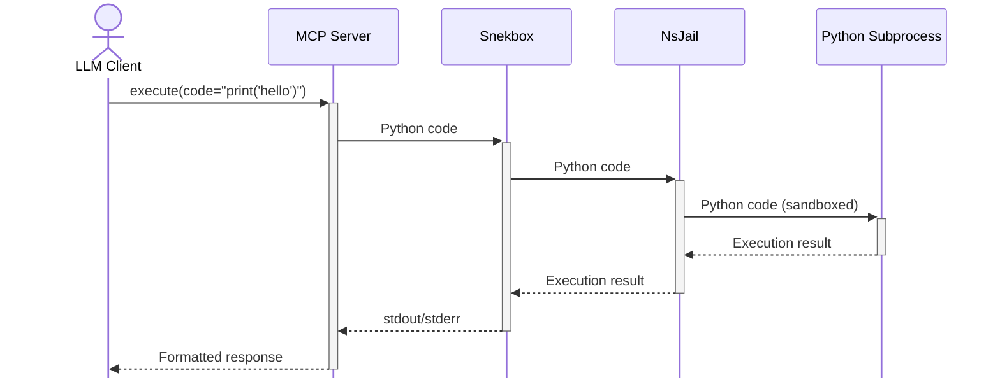

# Snekbox MCP Server

> [!NOTE]
> This is a fork of the original [Python Discord Snekbox](https://github.com/python-discord/snekbox) project with added Model Context Protocol (MCP) support. For the original HTTP REST API functionality and complete documentation, please refer to the [official repository](https://github.com/python-discord/snekbox).

A Model Context Protocol server that provides secure Python code execution in a sandboxed environment. This server enables LLMs to execute Python code safely using [NsJail] sandboxing technology, the same battle-tested security approach used by Python Discord.

**Available Tools:**
- **execute** - Executes Python code in a sandboxed environment
  - `code` (string, required): The Python code to execute

## Security & Sandboxing

Snekbox uses [NsJail] to provide robust sandboxing for Python code execution. This multi-layered security approach includes:

### NsJail Security Features
- **Time limits**: Code execution is limited to 6 seconds to prevent infinite loops
- **Memory limits**: Restricted to ~70MB RAM with no swap to prevent memory exhaustion  
- **Process limits**: Maximum of 6 processes to prevent fork bombs
- **Network isolation**: No network access by default (configurable for MCP)
- **Filesystem isolation**: Read-only system filesystem with isolated tmpfs working directory
- **User namespace isolation**: Code runs as unprivileged user (uid/gid 65534)
- **Resource limits**: CPU, memory, and file system quotas prevent resource abuse

### MCP Configuration Changes

The MCP version includes modified security settings in `snekbox.mcp.cfg`:

```diff
- clone_newnet: true    # Original: Complete network isolation
+ clone_newnet: false   # MCP: Allows network access for AI model calls

+ # Additional DNS resolution support
+ mount {
+     src: "/etc/resolv.conf"
+     dst: "/etc/resolv.conf"
+     is_bind: true
+     rw: false
+ }
+ 
+ mount {
+     src: "/etc/hosts"
+     dst: "/etc/hosts"
+     is_bind: true
+     rw: false
+ }
```

**Why This Is Still Secure:**
- Network access is granted but all other isolation layers remain intact
- Code still runs in isolated user/process/filesystem namespaces
- Resource limits prevent DoS attacks
- No persistent storage or system access
- Execution time and memory limits prevent runaway processes

## How It Works



The MCP server receives Python code from LLM clients and executes it through the same secure NsJail sandbox used by the original snekbox, with the addition of network access to support AI model interactions.

## Installation

```bash
git clone https://github.com/philschmid/snekbox-mcp.git

# Build the MCP image
docker build -f Dockerfile.mcp -t snekbox-mcp .

# Run with network access for AI model calls 
docker run --rm -it --dns=8.8.8.8 -p 8000:8000 --name snekbox-mcp --privileged snekbox-mcp 
```

The server will start on `http://0.0.0.0:8000/mcp/`

## Usage Examples

Add to your `mcpServers` configuration:


**HTTP Mode:**
```json
{
  "mcpServers": {
    "snekbox": {
      "url": "http://localhost:8000/mcp/"
    }
  }
}
```

### With MCP Inspector

Start the server and test it using the MCP inspector:

```bash
# In another terminal, start the inspector
npx @modelcontextprotocol/inspector
```

## Third-party Packages

By default, the Python interpreter has access to the standard library plus any packages installed in the container. The MCP version includes `google-genai` pre-installed for AI model interactions.

To add additional packages to a running container:

```bash
docker exec snekbox-mcp /bin/sh -c \
    'PYTHONUSERBASE=/snekbox/user_base /snekbin/python/default/bin/python -m pip install --user numpy pandas'
```

## Configuration

The MCP server uses a modified NsJail configuration (`snekbox.mcp.cfg`) that enables network access while maintaining all other security restrictions. Key differences from the original:

- **Network Access**: `clone_newnet: false` allows outbound connections
- **DNS Resolution**: Mounts `/etc/resolv.conf` and `/etc/hosts` for name resolution
- **Same Security**: All other isolation and resource limits remain unchanged

For more detailed configuration options, see the [original snekbox documentation](https://github.com/python-discord/snekbox#configuration).

## Development

Based on the original Python Discord snekbox project. See the [original repository](https://github.com/python-discord/snekbox) for development guidelines and contributing information.

## License

This project is licensed under the MIT License, same as the original snekbox project.

## Credits

- Original [Snekbox](https://github.com/python-discord/snekbox) by Python Discord
- [NsJail](https://github.com/google/nsjail) by Google for sandboxing technology
- [FastMCP](https://github.com/pydantic/fastmcp) for MCP server implementation

[NsJail]: https://github.com/google/nsjail
